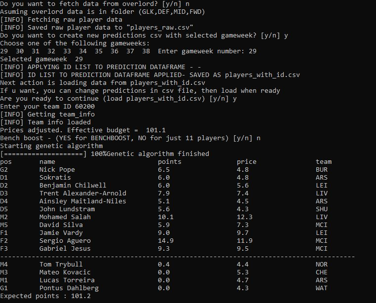

# Genetic algorithm for Fantasy Premier League

Genetic algorithm for FPL calculates best possible team for selected gameweek. 
It uses parts of [vaastav FPL library](https://github.com/vaastav/Fantasy-Premier-League) to get 
players raw data and transfers and squad info of any team. All transfer costs and budget are automatically 
calculated for any team (your custom team ID). 
To get player points prediction it uses [fantasy overlord](https://fantasyoverlord.com/FPL), but once that
data is fetched you can manually change any player point prediction in .csv files easily. 

You can choose which chip you want to use: 

1. Freehit for best 11 
2. Benchboost for best 15 (asume you want to use wildcard week before)

Structure of genetic algorithm is inspired by [NFL fantasy](https://github.com/conorkcorbin/evolve-dfs)

Algorithm should be updated every season because overlord and official FPL don't use the same names for players and 
some players are then double named, so combining players_raw and players_with_id probably wouldn't work next season. 

***If you are using this code outside of season, there is folder gw-29 made with data fetched before gameweek 29, so you can check or tweak algorithm without having to worry about seasonal changes.***

## Dependencies

python 3

pandas, numpy, beautifulsoup, collections, unidecode

## How to use 

Usage: python fpl_main.py  

This opens interactive console. Follow the instructions.
If opening for the first time fetch data from overlord and create new predictions .csv with selected gameweek.
players_raw and players_with_id are then created. 
If you want to change predictions manually do it in players_with_id.csv. You can do it by changing 
values in average column. 

Next step enter your team ID and select if you want benchboost. 

In next step best team is selected and in expected points it is assumed you choose player 
with highest point prediction as captain. 

## To add in future 

If benchboost is not choosen, fix lowest possible goalkeeper. When search is finished minimize bench cost with cheaper players
then try to find improvements in first 11 by basic search without changing formation. 

# Authors 
**Marko Kadijević**

 
